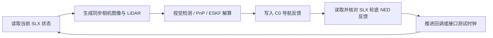

# 导航与 innerLoop.slx 的接口闭环

当前四相机导航已经接入仓库实际路径 `external/innerloop/simu/innerLoop.slx`。该模型的 8 个输入、12 个输出和 MATLAB System `convert` 满足当前固定 C0 的导航合同；本次对齐在 Python 调度、MATLAB 适配和运行配置中完成，使用已有 SLX 原位执行，不重建模型。`innerLoop_landing.slx` 不参与该入口。

在不提供直升机/舰船动力学与控制器的前提下，可运行接口闭环：以显式状态保持模式推进仿真时钟，或由 `plant_step_callback` 提供下一时刻的状态。没有动力学时，此闭环用于核对传感器、导航、反馈和因果次序，位置不会自动因导航反馈而改变。

## 信号对应

| 方向 | SLX 信号 | Python/适配层定义 |
| --- | --- | --- |
| 读取 | `T_world_deck` | H 中心与甲板系在 ENU world 的位姿，生成传感器使用 |
| 读取 | `T_deck_camera` | 固定参考 C0 相机在甲板系的真值位姿，只供渲染/评估 |
| 读取 | `velocity_deck` | C0 相机相对 H、在旋转甲板系中的位置导数，m/s；只供评估 |
| 写入 | `nav_T_deck_camera` | `NavigationEstimate.T_deck_camera`，所有相机 PnP 已转换到 C0 |
| 写入 | `nav_velocity_deck` | `NavigationEstimate.velocity`，C0 的甲板系相对速度，m/s |
| 写入 | `nav_covariance` | `NavigationEstimate.covariance`，6×6，甲板平移/相机局部右乘旋转误差 |
| 写入 | `nav_healthy` | `NavigationEstimate.healthy`，转为 double 0/1 |
| 写入 | `nav_timestamp` | 当前导航状态时间，与 SLX `timestamp` 一致 |
| 转换输出 | `gear_relative_estimate_ned` | 轮底平面中心减 H 中心的北/东/地向量，m |
| 转换输出 | `relative_covariance_ned` | 该 NED 向量的 3×3 条件协方差 |
| 转换输出 | `relative_distance_estimate_m` | 三轴 NED 相对距离的欧氏模长 |
| 转换输出 | `feedback_valid` | 健康、时间同步、数据和姿态/协方差合法性检查结果 |

飞机状态为 `[CG_NED_m; velocity_BODY_knot; Euler_rad; omega_BODY_rad_s]`，舰船为 `[CG_NED_m; velocity_NED_knot; Euler_rad; omega_BODY_rad_s]`，均为 12 维列向量。SLX 完成 knot → m/s、姿态旋转和质心到相机/H/轮底的杆臂转换。`omega_BODY` 是 p/q/r，不能填 Euler 角导数。

`convert.T_body_camera` 必须属于固定 C0；相机来源切换不更换该参数。`H_ship_body`、`gear_body` 与相机外参在仿真前通过 Model Workspace 设置。舰船姿态按既定理想通信通道提供；`convert` 内部和 Python `read_navigation_context` 使用一致的 `R_NED_deck`。

## 每个状态时刻的因果次序



`Scheduler.groups()` 将同一时刻的相机、LiDAR、控制事件合并。先读取一次状态，生成此时刻到期的传感器观测，按视觉 → LiDAR 顺序更新并预测至当前时刻，再向 MATLAB 写入一次反馈。传感器单独到期的时刻同样完成反馈事务；未来控制器仍需保留自己的控制采样周期，不能把每次导航反馈写入直接当成控制采样。

`advance()` 返回新状态快照，宿主不重复读取。控制日志按 `control_hz` 记录；审计日志记录每个状态时刻的事件、操作顺序和导航/SLX 反馈。SLX `StopTime=0` 只是转换快照，状态与时间由外层回调管理，不在读取过程中积分。

初始化会核对实际模型文件、输入输出名称/编号/尺寸、`convert` 类型及三个工作区参数表达式，防止读到另一个同名模型或被字面常量覆盖的安装参数。Simulink 输出 Dataset 的信号标签可能为空，因此适配层使用已校验的根 Outport 编号读取，不能依赖 Dataset 元素名称。

MATLAB 拒绝：未读当前状态就写反馈、未反馈就推进、重复反馈、旧时间反馈以及错误参考相机。推进后清除旧反馈和读标志，避免把上一步反馈当成当前状态有效反馈。Python 每次读取实际 `read_innerloop_feedback`，将 SLX 转换出的三轴 NED 距离、模长、协方差和有效性与独立 Python 计算核对；日志 `feedback.source=innerLoop.slx` 表明反馈来自实际模型。

## 可运行配置

```bash
# 完整合同测试 + 四相机/雷达/导航/SLX 往返检查
.venv/bin/python -m simulation.offline.verify_innerloop_navigation

# 只运行接口导航循环
.venv/bin/python -m simulation.offline.run_closed_loop --config configs/innerloop_navigation.yaml
```

需要 MATLAB/Simulink R2024b 和已安装的 Engine。配置 `configs/innerloop_navigation.yaml` 是显式接口测试：相机 10 Hz、LiDAR 7 Hz、控制日志 20 Hz、持续 0.3 s，故意包含非控制采样时刻的雷达事件，检验异频调度。

`geometry_from_camera_rig=true` 显式复用当前训练集的设计几何，确保四相机/C0、H 中心和轮底定义一致；这些值仍是代理尺寸。显式填写的 geometry 如果与自动取值冲突会报错。模型自身未填写的工作区参数保持原先的 NaN 模板，启动时由 SimulationInput 注入配置，不把设计尺寸持久写为实机标定。

该入口以 `checkpoint:null` 使用现有图像经典 H 检测器，实际执行图像检测、PnP、ESKF 和 LiDAR，并非用真值代替视觉测量。需要正式共享网络时，将配置中的 `navigation.checkpoint` 改为训练好的 `.pt` 或 `.onnx`；初始位置/姿态是配置先验，代码不从 SLX 真值自动初始化。

后续接入动力学时，填写真实 geometry、原生状态，设置 `allow_state_hold=false` 与 `plant_step_callback`。回调接收 `s.feedback` 中的三轴 NED 距离、距离模长、协方差和 `valid`，更新状态/控制器并将时间增加 dt。健康失效后的下降暂停或退出必须由该控制器实现。缺少回调且未显式启用状态保持时继续报 `landing:MissingDynamics`。

## 本次实际结果

2026-10-07，本机 MATLAB/Simulink R2024b 执行成功。9 次状态读取、9 次导航反馈、8 次推进、9 次实际 SLX 反馈比对；4 组同步四相机图像（16 张）产生 4 次视觉更新，3 帧 LiDAR 产生 3 次平面更新；7 个控制采样记录。SLX/Python 距离与协方差转换最大绝对差约 3.55×10⁻¹⁵，完整位姿健康比例 100%。

静态简化图像场景的 C0 位置 RMSE 约 0.130 m，仅说明这次接口执行结果，不代表三阶段着舰、真实图像或正式网络精度。MATLAB 合同测试另用一个明确的测试回调读取本时刻反馈、替换下一时刻原生状态，确认下一次读到变化后的状态与位姿；该回调没有动力学。

验证摘要、控制日志、逐时刻审计日志分别为 `outputs/metrics/innerloop_navigation_verification.json`、`outputs/logs/innerloop_navigation.jsonl`、`outputs/logs/innerloop_navigation_audit.jsonl`。可审阅的验证摘要另保存于 `output/verification/innerloop_navigation.json`。本次验证以 SHA-256 确认实际执行没有改写 SLX 文件。
